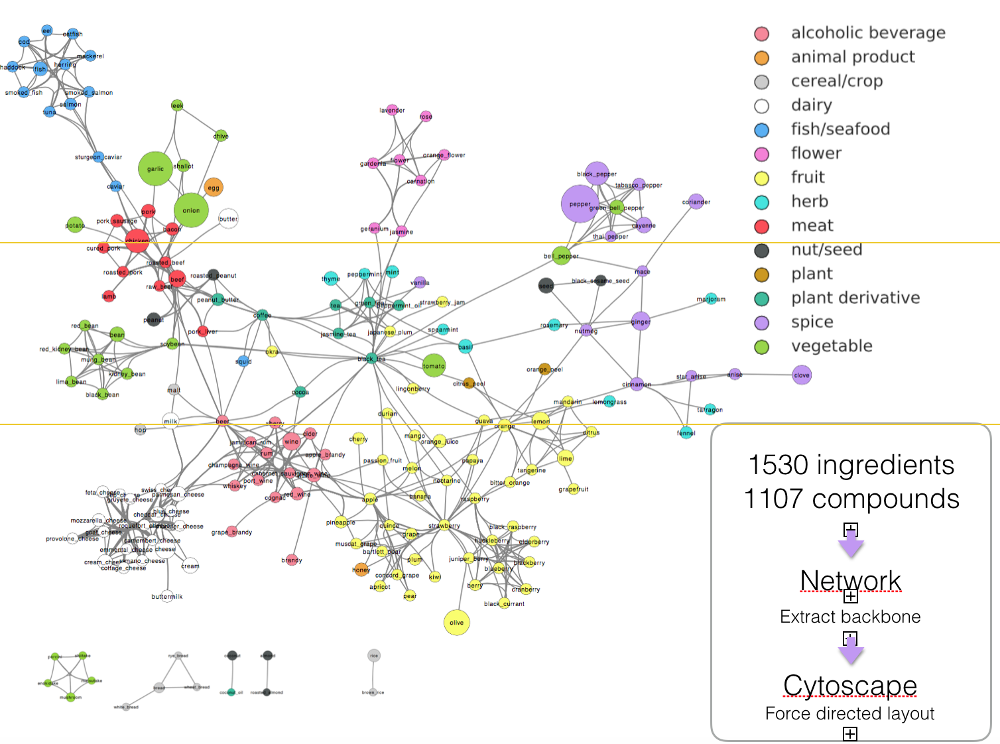
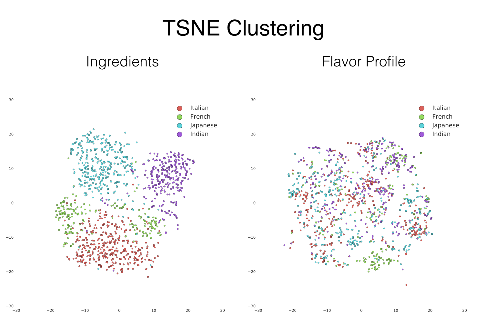
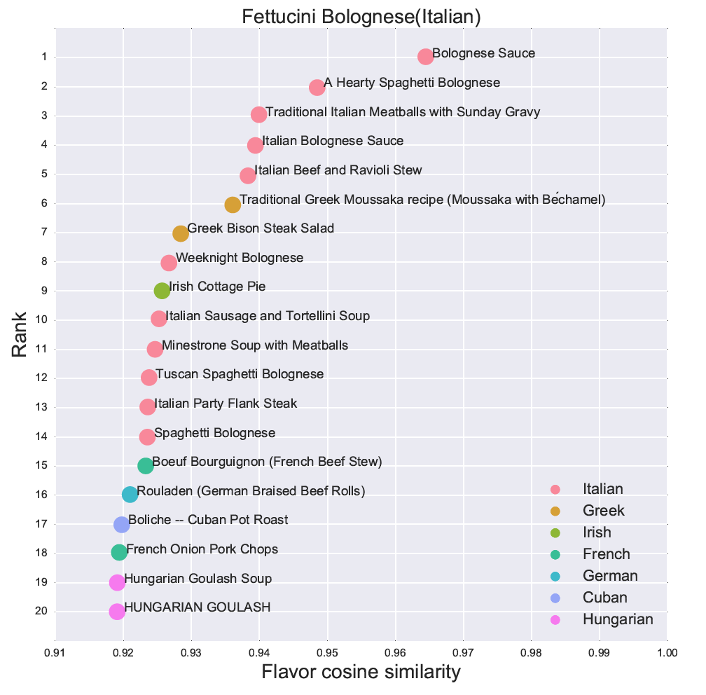

#Flavor Network
Flavor network is a graph network of food ingredients based on flavor compounds they share. Using flavor network, I am able to project recipes from ingredient space to flavor space, and build a dish recommender based on similar flavor profile. It is a fun way to find dishes with similar flavor to your favorite dish but from another regional cuisine.

##Data and graph
Flavor profile data came from Y-Y Ahn's work (see reference), including 1530 food ingredients, flavor compounds and 36,781 edges. Using networkx and cytoscape, I am able to build food flavor network, with each node representing a food ingredient and the edge between nodes representing the number of flavor compounds they shared. The original network is too dense to visualize. After backbone extraction, I am able to produce a more visually compelling network graph, albeit with less ingredients, as only ingredients with significant connections to others are kept after backbone extraction.

##Classification and clustering of regional cuisines
The next step is to project recipes with ingredient lists into the flavor space. I scrapped ~9,000 recipes using Yummly's API and pickled the dataframe. After cleaning up, I am able to match ~7000 recipes into the ingredient space. (Some recipes have to be discarded as their ingredients are not listed in the flavor network.) Using ingredient-flavor matrix, I am able to map these recipes into flavor space, with counts for each flavor compound.
Using ingredient information as features, I am able to classify recipes into regional cuisines with 71% accuracy. I compared logistic regression, randomforest classifier, support vector machine, mulinomial naive bayes and tuned parameters. Support vector machine with linear kernels performed the best, with 71% accuracy. The accuracy could be higher if I eliminate some cuisines such as barbeque. Using flavor profile as features, classification accuracy is only 0.56, suggesting more overlap in the flavor space.
Using TSNE clustering to visualize multi-dimensional data, it is clear that different regional cuisines form distinct clusters in the ingredient space, but not the flavor space, suggesting significant flavor overlap from different regional cuisines.

##Dish Recommender based on flavor similarity
Based on cosine similarity, I am able to recommend dishes based on flavor. The recommender will return top 20 dishes most similar to the query, in terms of flavor. The top matches usually come from the same region. Top 20 matches usually include dishes from other regional cuisines. This is a fun way to discover new cuisines based on flavor profile.  

##Future directions
A caveat of the flavor network is that it didn't have information on the concentration of each compound, only yes for above a certain threshold, and no for below the threshold for each compound. We all know that concentration play an important role in taste and flavor.
Another caveat is that the flavor network covers only primary ingredients, but not compound ingredients, such as pesto, miso, and hoisin sauce, just to name a few commonly used compound ingredients in cooking.
For dish recommender, the quality of recipes is also important, as each ingredient in the recipe should play a role in shaping the flavor of that dish. Recipes with high-quality and mainly primary ingredients will get better matches than those with low-quality and some compound ingredients. Finally, human taste perception is rather complex, influenced by other sensory experience such as smell and temperature.  
The current version of dish recommender based on flavor network has a lot of room for improvement. A more comprehensive flavor compound dataset, including compound concentration and covering more food ingredients will improve it tremendously. A bigger dataset of recipes will improve the recommender as well, perhaps to a lesser degree than the flavor compound dataset.

##Toolkit
pandas  
sklearn 
cytoscape  
networkx  
numpy  
scipy  
nltk 
matplotlib 
seaborn 
webscrapping 
pickle 
EC2 
S3 for backup 

##Reference
Flavor network and the principles of food pairing. Y.-Y. Ahn, S. Ahnert, J. P. Bagrow, and A.-L. Barabási . Scientific Reports 1, 196 (2011)
